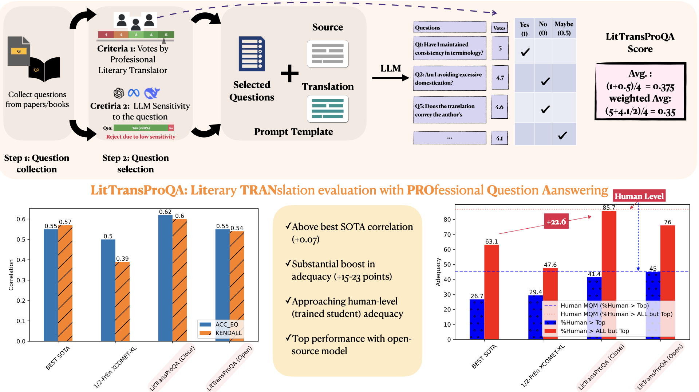

# LiTransProQA
LLM-based Literary Translation evaluation metric with Professional Question Answering

# Project Name <br><sub><sup>A one-line description of what this project does or solves</sup></sub>
<p align="left">
  
</p>

[](https://huggingface.co/models?library=your-library-name)
[](https://arxiv.org/abs/your-arxiv-id)

## 📁 Repository Structure
```
LitTransProQA/
├── datasets/                    # Dataset directory
│   ├── finetuning_dataset/     # Datasets for model fine-tuning
│   └── evaluation_set/         # Datasets for evaluation
├── finetuneing_method/         # Fine-tuning related code
│   ├── configs/               # Configuration files
│   ├── xcomet_regression.py   # Regression task
│   ├── xcomet_inference.py    # Inference implementation
│   └── xcomet_ranking.py      # Ranking task
├── prompting_method/          # Prompt-based approaches
│   ├── template/             # Prompt templates
│   ├── QA_translators/       # translator voting results
│   ├── prompt_openrouter.py  # API integration
│   ├── run_all_models.py     # Model execution script
│   └── build_dataset.py      # Prompt preparation
└── SOTA_metric/              # State-of-the-art metrics
    └── m_prometheous.py      # Prometheus metric implementation
```

---

## 🛠️ Setup & Installation


---

## 🚀 Usage

- **Multiple Assessment Methods**:
  - Fine-tuning based approaches using XCOMET
  - Prompt-based LitTransProQA: question-answering-based translation evaluation
  - Other SOTA metrics
 
    
- Instructions to run the project or reproduce results:

```bash
# Example: Running a training script
python src/train.py --config configs/config.yaml

# Example: Generating predictions
python src/predict.py --input data/test.json --output outputs/predictions.json
```

Or you can explore the notebooks inside the notebooks/ directory for interactive examples.

---

## 🧪 Testing & Evaluation

To evaluate model performance or run tests:

```bash
# Run unit tests (if available)
pytest tests/

# Evaluate with specific metrics
python src/evaluate.py --model-path models/model.pt
```

---

## 📊 Results Overview


## 📌 References

(Optional) Mention datasets, papers, repositories, or blogs used as a base or for inspiration:

- [Dataset or Paper Name](https://link-to-resource)
- [Blog Post or GitHub Repo](https://link)

---

## 🤝 Contributing

Feel free to contribute by submitting a pull request.

```bash
# Fork the repository
# Create a new branch for your feature or fix
# Commit your changes with a clear message
# Push to your fork and submit a PR
```

---

## 📜 License

Specify the license under which this code is shared.

> This project is licensed under the CC License - see the [LICENSE](LICENSE) file for details.

---

## 📖 Citation

If you use this work in your research, please cite it as:

```bibtex
@misc{zhang2025litransproqallmbasedliterarytranslation,
      title={LiTransProQA: an LLM-based Literary Translation evaluation metric with Professional Question Answering}, 
      author={Ran Zhang and Wei Zhao and Lieve Macken and Steffen Eger},
      year={2025},
      eprint={2505.05423},
      archivePrefix={arXiv},
      primaryClass={cs.CL},
      url={https://arxiv.org/abs/2505.05423}, 
}
```

---
